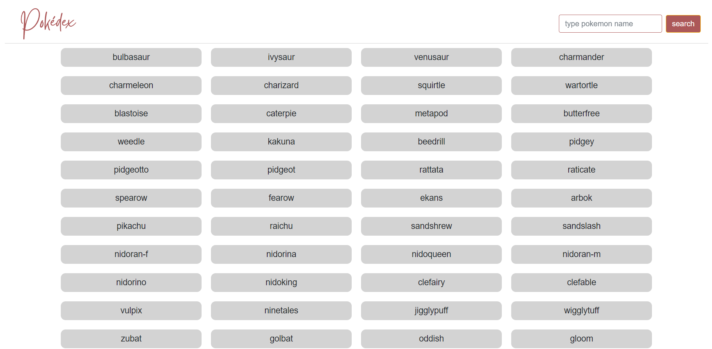

# JavaScript App *(Pokédex)*

### This is a small web application with HTML, CSS, and JavaScript that loads data from an external API and enables the viewing of data points in detail.
 

</img>

#### In this project I used the following technologies:
1. HTML
2. CSS
3. JavaScript

#### Check deployed code: <a href=https://tinnkie.github.io/simple-js-app/ target="_blank"> Pokedex </a>
#### Check my code: <a href=https://github.com/Tinnkie/portfolio-website target="_blank"> GitHub </a>
#### Check my Portfolio Website: <a href=https://tina-atanasova.netlify.app/index.html target="_blank"> Tina Atanasova </a>
